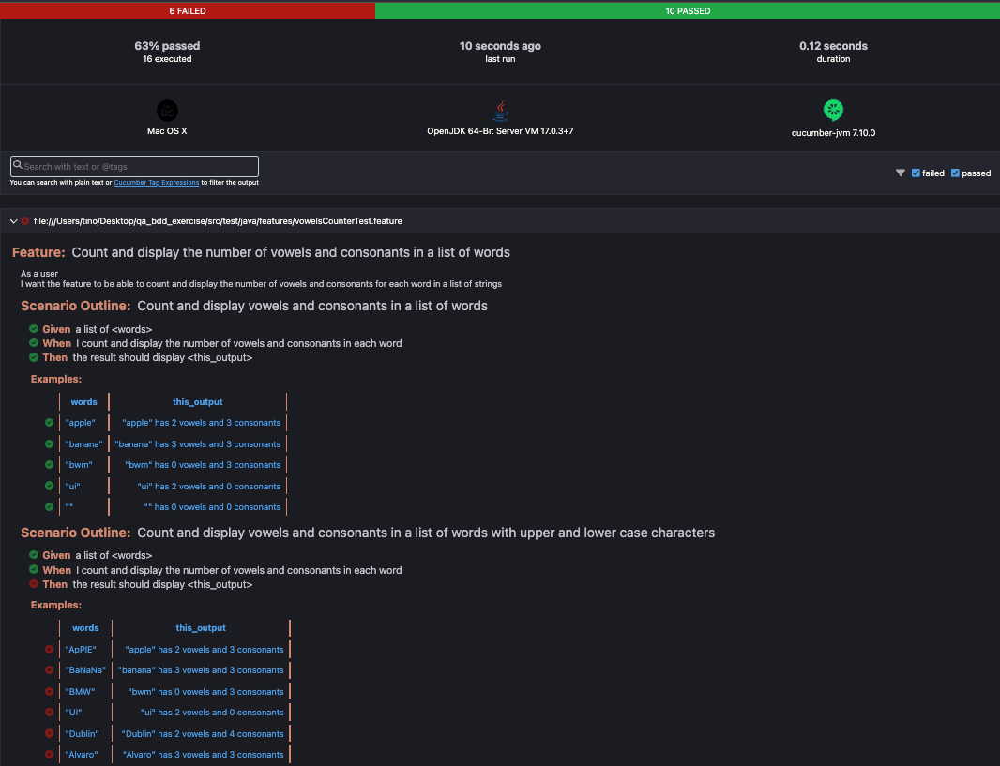

# CORE FEATURES
- As a user I want to be able to add a list of strings. 
- I want to see the number of vowels in each of the strings that I have entered.

## ACCEPTANCE CRITERIA
### Adding a list of strings
- Add 4 string max at once

### Counting vowels
- Display the number of vowels and consonants for each string in the order they are keyed in.
- Examples:
  - BMW > 0 vowels / 3 consonants
  - ui > 2 vowels / 0 consonants
  - Window > 2 vowels / 4 consonants

## ASSUMPTIONS
- Assumption: Strings cannot be empty
- Assumption: Strings will be entered in latin alphabet
- Assumption: Strings cannot contain special characters/numbers
- Assumption: Strings cannot contain empty spaces.
- Assumption: It will be possible to verify strings with no vowels, in this case we should display zero
- Assumption: It will be possible to verify strings with no consonants, in this case we should display zero
- Question: Will we have a min/max num of characters accepted for strings?

## TEST COVERAGE AND SCENARIOS
- CountResult class 100% coverage
- VowelCounter class 100% coverage
- Verify the number of vowels and consonants for each string in the order they are keyed in. >> inputWordsWithVowelsAndConsonants
- Verify a string with zero vowels. >> inputWordWithZeroVowels
- Verify a string with uppercase vowels. >> inputWordWithUppercaseVowels
- Verify a string with uppercase consonants. >> inputWordWithUppercaseConsonants
- Verify a string with zero consonants. inputWordWithZeroConsonants
- Verify a list of strings with non-latin characters. >> inputListWithNonLatinAlphabetWords
- Verify a list of strings with more than 4 inputs. >> inputMoreThanFourWords 
- Verify an empty list of strings. >> inputEmptyList
- Count and display vowels and consonants in a list of words - vowelsCounterTest

## Bugs
- Strings with uppercase vowels, ie: names, cities. Vowels are not counted when uppercased.
(unit test written for this inputWordWithUppercaseVowels)
- Strings with uppercase consonants, ie: names, cities. consonants are not counted when uppercased.
(unit test written for this inputWordWithUppercaseConsonants)
- It would be good if we could display a warning/error when the user inputs strings written in non-latin alphabets. 
Currently, the program return zeros for vowels and consonants in this case.
(unit test written for this inputListWithNonLatinAlphabetWords)

## Notes
- CountResult class Getters and Setters will not be covered by unit tests.
- html report is located under src/test/reports



## Test Execution
- Prerequisites: maven installed, jvm installed, all dependencies installed.
- All Unit tests and BDD tests can be run as follows:
  - Open the cmd or terminal 
  - cd into the project directory and use the maven to execute all tests: ```mvn clean test```


